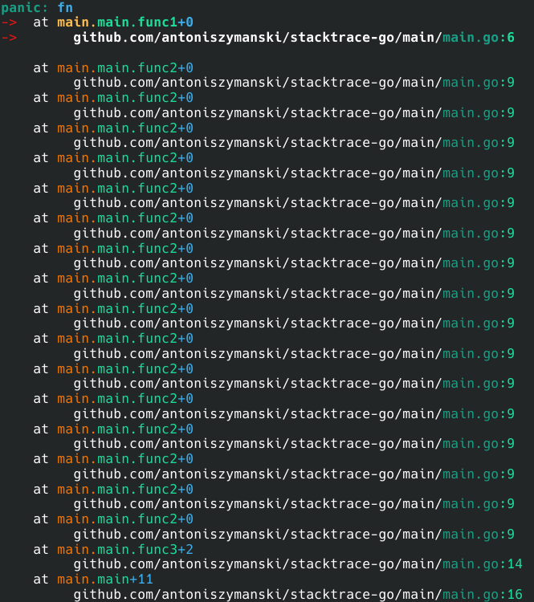

## stacktrace-go

An alternative to Go's native stack trace, that:

- has colorized output
- is [fast](#benchmark)
- is thread-safe
- shows go statement that created the panicking goroutine
- shows the number of lines from the start of the function to the current line
- allows to customize the printing of panic values
- supports [NO_COLOR](https://no-color.org) environment variable

Tip: use -trimpath build flag to get shorter stack traces

Documentation: https://pkg.go.dev/github.com/antoniszymanski/stacktrace-go

### Installation:

```
go get github.com/antoniszymanski/stacktrace-go
```

### Example:



### Benchmark:

```
goos: linux
goarch: amd64
pkg: github.com/antoniszymanski/stacktrace-go
cpu: Intel(R) Core(TM) i7-7700HQ CPU @ 2.80GHz
BenchmarkHandle-8   	   63949	     19769 ns/op	     752 B/op	       7 allocs/op
PASS
ok  	github.com/antoniszymanski/stacktrace-go	1.460s
```
